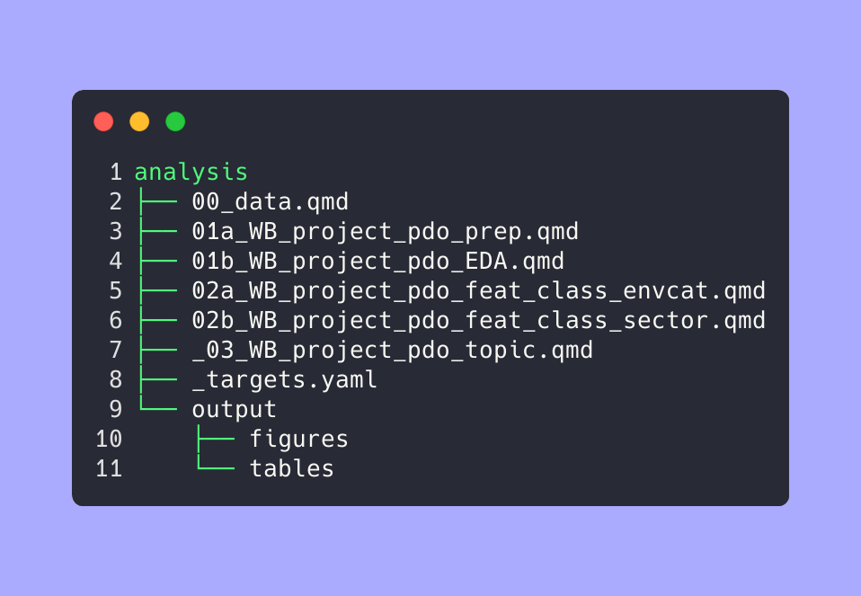

<!-- README.md is generated from README.qmd. Please edit that file -->

# PROJECT

An NLP analysis of World Bank Project Development Objectives (PDOs) text
data.

# CORE files

``` bash
# tree analysis -C -L 2 # then https://carbon.now.sh/
tree -n --noreport analysis -L 2 -I "_zz_old_files" | silicon --language bash -o images/tree.png
```



# TO READ

- study articles in `research/_model-idea.qmd` top (Dinamic topic
  modeling over time)

# TO DO

- Access all tidy tuesday port for week 12 2025
  [bluesky](https://bsky.app/search?q=week+12+%23tidytuesday)

- Read:

  - [R pckg to use LLm to summarize from
    PDF](https://posit.co/blog/mall-ai-powered-text-analysis/)
  - [Tidy tuesday on TExt
    analytics](https://github.com/rfordatascience/tidytuesday/blob/main/data/2025/2025-03-25/readme.md)
    - [spiega](https://gregoryvdvinne.github.io/Text-Mining-Amazon-Budgets.html)

- In ~~`analysis/01c_WB_project_pdo_feat_class.qmd`~~ tutto da rivedere
  …. SPLIT:

  - ☑️ `analysis/02a_WB_project_pdo_feat_class_envcat.qmd` (small things
    to clean up)
  - `analysis/02b_WB_project_pdo_feat_class_sector.qmd`

- Study the theory of Lasso Regr and Classification with ML on Gabor’s
  book

  - BOOK chp 14 [Prediction with
    LASSO](https://github.com/gabors-data-analysis/da-coding-rstats/tree/main/lecture22-lasso)
  - [lelc 25 class
    ML](https://github.com/gabors-data-analysis/da-coding-rstats/tree/main/lecture25-classification-wML)

- Follow [Supervised classific
  text](https://bookdown.org/f_lennert/text-mining-book/supervisedml.html)

- ~~re-write the attempted models in more condensed form
  (`workflowsets`)~~

- THEN

  - ➡️ Revise `_target.R` …with new input files …
  - ➡️ REvise tab with `analysis/00_data.qmd`

<!-- 
# + mandare a 
#    + tipo di Data ninja
#    + tipo Vincenzo
#    + gianni  
#    + michele MD a DC 
-->

# Abstract

## Exploring World Bank Project Development Objectives (PDO) text data

This ongoing project serves as a proof-of-concept for applying text
analytics to World Bank Projects & Operations data. Focusing on ~4,000
projects, I analyze the short texts that define *Project Development
Objectives (PDOs)*—concise summaries of each project’s goals. This
exploration has uncovered intriguing insights, including:

- Trends in sector-specific language and thematic shifts over time,  
- Unexpected patterns, such as recurring topics, phrases and conceptual
  relationships,  
- Enhanced text classification and metadata tagging through machine
  learning,  
- Novel text-based questions that could inform further research.

The analysis is conducted in R, integrating text mining, natural
language processing, and machine learning techniques.

(This is an ongoing project, so comments, questions, and suggestions are
welcome. The R source code is open, albeit not very polished).

# References

- [Mary Sanford -
  Bocconi](https://sites.google.com/view/marysanford/projects-in-development?authuser=0) -
  Policlim salience of “climate change” in EU political manifestos …
  [preprint](https://osf.io/preprints/osf/bq356)

- [Christopher Manning](https://nlp.stanford.edu/~manning/) - NLP in
  general/linguistics
